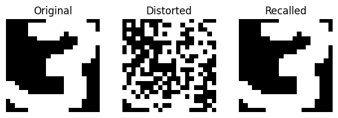

# Hopfield Network on MNIST  

Implemented a **Hopfield Network** as an associative memory model on the MNIST dataset.  
After preprocessing (cropping, resizing, and binarizing), I stored **10 patterns**  
(one for each digit) in the network using the **Hebbian rule**.   

To test recall, I applied **30% noise** to the test images, and the Hopfield Network  
was able to recover the original digits, demonstrating its ability to denoise and  
retrieve stored patterns.

## Result Example   
  
- More examples can be found in [main.ipynb](main.ipynb) 
